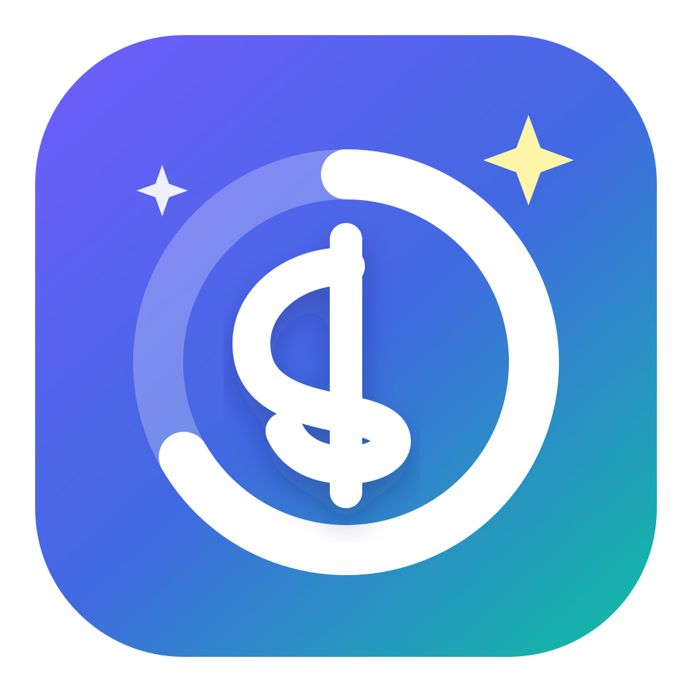
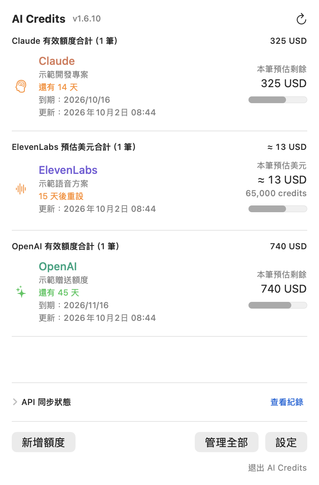

<p align="center">
  
</p>

# AI Credits

**把 AI 額度與到期日放在 Mac 選單列。**

A native macOS menu bar app for AI credit balances, cost estimates, and expiry reminders. Built with SwiftUI. Free and open source under the MIT license.

[](https://github.com/Wolke/ai-credits/actions/workflows/ci.yml)
[](LICENSE)


不用逐一打開帳務後台，點一下選單列，就能查看各平台的有效額度合計、每筆餘額及剩餘天數。介面目前以繁體中文為主。

<p align="center">
  
</p>
<p align="center"><em>畫面使用虛構示範資料，非真實帳戶或官方價格。</em></p>

## 能做什麼

- 在選單列直接看餘額、各筆額度與到期日，捲動即可查看全部。
- 追蹤一次性贈送額度，也能建立每月發放的額度紀錄。
- 讀取 OpenAI／Claude 的組織 API 花費，或 Gemini 的 Google Cloud 帳務資料，估算剩餘額度。
- 讀取 ElevenLabs 方案 credits 與重設時間；可自行設定比例換算預估 USD。
- 到期前 30、7、1 天及到期當天通知提醒；通知需獲得 macOS 授權且 App 正在執行。
- 顯示每次同步的成功／失敗、HTTP 請求次數、錯誤原因及最近成功時間。
- 資料留在自己的 Mac，金鑰存於 macOS Keychain，沒有專案自建的後端或遙測。

## 支援哪些平台

| 平台 | 自動取得 | 需要自行設定 |
| --- | --- | --- |
| OpenAI | 組織 API 花費 | Admin API Key、原始／目前額度、取得日、到期日 |
| Claude | 組織 API 花費 | Admin API Key、原始／目前額度、取得日、到期日 |
| Gemini | BigQuery 帳務匯出的 Gemini gross cost | Service Account、表名、額度與日期 |
| ElevenLabs | 方案總 credits、已使用量、剩餘量、API 提供的重設時間 | User → Read 金鑰；USD 換算比例為選填 |
| Lovable、Notion | 手動管理 | 額度、單位、日期與使用後的餘額 |

**OpenAI／Claude／Gemini 顯示的是本機預估餘額。** 本專案使用的 API 不會自動填入原始贈送額度與到期日，也不追蹤 ChatGPT／Claude 網頁訂閱的訊息配額。各平台的花費期間、折抵方式與資料延遲可能造成差異；請參閱[計算規則與平台設定](docs/PROVIDERS.md)。

## 安裝

目前提供**從原始碼在自己的 Mac 編譯安裝**。尚未提供經 Apple Developer ID 簽署、公證的可下載安裝包。

需要 **macOS 14+、Swift 6+、Git**。先安裝適合自己 macOS 版本的 Xcode 或 Command Line Tools，執行 `swift --version` 確認版本；詳細步驟見[安裝指南](docs/INSTALL.md)。

```bash
git clone https://github.com/Wolke/ai-credits.git
cd ai-credits
./Scripts/install.sh
```

腳本會建立／沿用本機簽署身分、編譯及安裝 App，預設放在 `~/Applications`。若 `/Applications` 已有 AI Credits，則更新該位置。全程以自己的使用者帳號執行，**不需要 sudo**。

首次簽署或讀取金鑰時，macOS 可能要求授權。請依系統視窗確認 `codesign`／`AICreditsKeychain` 的存取；後續更新會沿用相同的簽署身分與金鑰工具。[安裝、更新、移除及授權說明](docs/INSTALL.md)

## 第一次使用

1. 打開 AI Credits，點選 macOS 右上角選單列的信用卡圖示。
2. OpenAI、Claude、Gemini、Lovable、Notion：按「新增額度」，填寫額度、單位及日期。
3. 需要自動同步的平台，在「設定」輸入對應金鑰並按「儲存並測試」。ElevenLabs 測試成功後會自動建立方案額度。
4. 選擇餘額模式：已知完整原始額度及花費期間時使用「以原始額度自動計算餘額」；若輸入的是目前剩餘額度，使用手動基準模式。
5. 展開「API 同步狀態」或按「查看紀錄」，確認有實際 HTTP 請求與最近成功時間。

OpenAI、Claude、ElevenLabs 每 15 分鐘檢查一次，Gemini 每 6 小時查詢一次；也能手動同步。API 失敗時保留上次數字並顯示錯誤。

## 文件與參與

- [安裝、更新與常見問題](docs/INSTALL.md)
- [API 權限、計算規則與限制](docs/PROVIDERS.md)
- [資料儲存與隱私](docs/PRIVACY.md)
- [開發、測試與簽署](docs/DEVELOPMENT.md)
- [貢獻指南](CONTRIBUTING.md) · [安全問題回報](SECURITY.md) · [版本紀錄](CHANGELOG.md)
- [Facebook 分享文案](docs/FACEBOOK_POST.md)

遇到問題或有功能想法，歡迎[開 Issue](https://github.com/Wolke/ai-credits/issues)。分享截圖或紀錄前，請先遮掉帳戶名稱、金鑰與不想公開的帳務資料。

## 授權

[MIT License](LICENSE) © 2026 Wolke。歡迎使用、修改與分享，請保留授權與著作權聲明。

本專案為獨立開源工具，與所列服務供應商無官方合作或隸屬關係。
