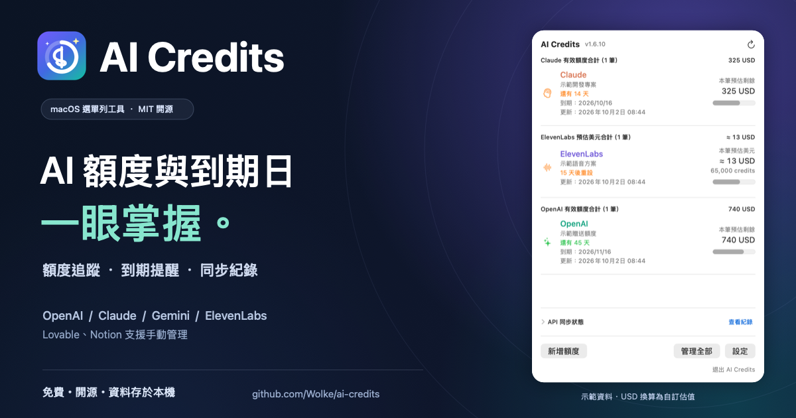

# Facebook 分享文案

以下可直接複製貼上，搭配 [FB 主圖（1200 × 630 PNG）](images/facebook-cover.png)。圖中的 App 畫面使用虛構示範資料。

若希望貼上 GitHub 連結時自動帶出主圖，可使用 [GitHub 分享預覽圖（1280 × 640 PNG）](images/social-preview.png)，到[專案 Settings](https://github.com/Wolke/ai-credits/settings)的 **Social preview → Edit → Upload an image…** 上傳。圖片已放進 README 不代表已設定連結預覽；這是 GitHub 的獨立設定。[官方設定說明](https://docs.github.com/en/repositories/managing-your-repositorys-settings-and-features/customizing-your-repository/customizing-your-repositorys-social-media-preview)

直接發 FB 圖片貼文時，上傳 `facebook-cover.png`，再貼下方文案與專案連結即可。

---

AI 工具越用越多，送的 credits 到底還剩多少、哪一筆快到期，每次都要打開好幾個後台查。

所以我做了一個 Mac 選單列小工具：AI Credits，現在把它開源了 🎉

點一下選單列，就能看到各平台的餘額、額度明細和到期天數，也有到期通知提醒。

目前可以：
・讀取 OpenAI、Claude 的 API 花費，估算剩餘額度
・透過 Google Cloud 帳務資料追蹤 Gemini 花費
・查看 ElevenLabs 剩餘 credits 和重設時間，也能自訂比例換算 USD
・手動管理 Lovable、Notion 額度
・查看 API 是否真的有呼叫，失敗時有錯誤紀錄可以追

資料留在自己的 Mac，API 金鑰存在 macOS Keychain。免費、MIT 開源，歡迎修改，也歡迎提 Issue 或 PR。

先說明一下：OpenAI／Claude／Gemini 的原始額度和到期日需要自己設定，畫面是依 API 花費計算的預估餘額；不是直接抓到官方贈送額度，也不是 ChatGPT／Claude 聊天訂閱的訊息配額。

目前支援 macOS 14+，需要 Swift 6 工具鏈從原始碼安裝，GitHub 已附安裝步驟與安裝腳本。

專案與安裝說明：
https://github.com/Wolke/ai-credits

如果你也常在不同 AI 平台之間切換，歡迎試用，有想追蹤的平台或使用上的問題也可以留言分享。

#AI工具 #macOS #開源 #SwiftUI #AICredits
